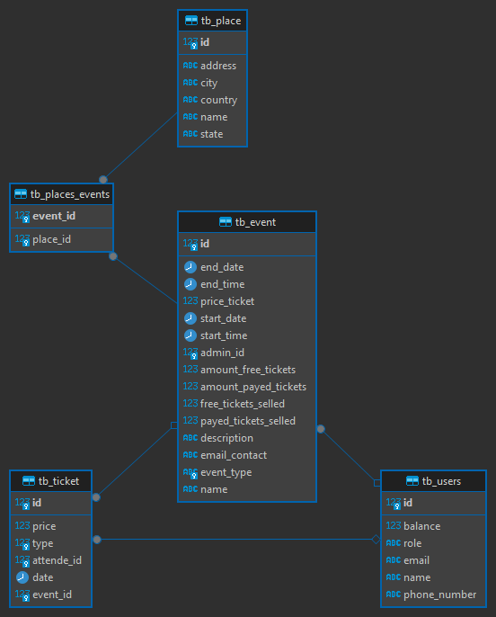

# AC2 - Programação Distribuída

O projeto foi gerado pelo [start.spring.io](https://start.spring.io/#!type=maven-project&language=java&platformVersion=2.4.4.RELEASE&packaging=jar&jvmVersion=11&groupId=com.h4ad&artifactId=ac1&name=ac1&description=O%20projeto%20de%20AC1%20de%20Orienta%C3%A7%C3%A3o%20a%20Objetos%20-%202&packageName=com.h4ad.ac1&dependencies=devtools,web,data-jpa,h2,postgresql,restdocs) para o projeto de AC2 da matéria de Programação Distribuída.

**A api já possui três eventos cadastrados para todas as capitais do Brasil e Distrito Federal, para obter essas informações basta usar o end point Get [Events-Places/city/{city}](#events-places)**

**A api também possui a documentação através do Swagger, basta acessar [aqui](http://localhost:8080/swagger-ui/index.html)**


Para publicar o serviço basta executar o comando:
``mvn spring-boot:run``

Nota: É necessário possuir Java e também o Maven cadastrado no computador para conseguir subir o serviço na porta 8080 (http://localhost:8080)

O ER do Projeto está de acordo com a imagem abaixo: 



A arquitetura para o projeto seguiu conforme imagem abaixo:


## Insomnia

Se você possuir o Insomnia, e quiser testar por ele, baixe o arquivo [insomnia.yaml](/insomnia.yaml) e importe no seu Insomnia.


## Rotas

Há as seguintes rotas:

## Events

- Get: /events
  - Busca todos os eventos, você pode passar os Query Params como `page` e `limit` para fazer paginação e seus detalhes são retornados nos `Headers`, e Query Params como `name`, `description`, `emailContact` ou `startDate` para filtrar os resultados ou fazer uma pesquisa.
  - Exemplo: /events?page=0&limit=1&name=Marcelo
  - Exemplo: /events?page=0&limit=1&startDate=2021-03-20
  - Exemplo: /events?page=0&limit=1&name=Marcelo

- Post: /events
  - Cria um novo evento.

 ```json
{
  "name": "Evento do Joga18",
  "eventType": "MOVIE_THEATER",
  "description": "Será um evento legal",
  "place": "Facens",
  "emailContact": "180998@facens.br",
  "startDate": "2021-03-21",
  "endDate": "2021-03-28",
  "startTime": "16:30:00",
  "endTime": "19:00:00",
  "amountFreeTickets": 10,
  "amountPayedTickets": 90,
  "priceTicket": 60.99,
  "adminId": 1
}
```

- Get: /events/{eventId}
  - Busca um evento pelo seu ID.
  
- Put: /events/{eventId}
  - Atualiza um evento pelo seu ID.

```json
{
  "name": "Evento do Joga11",
  "eventType": "THEATER",
  "description": "Será um evento legal para caramba.",
  "place": "Facens - LIGA",
  "emailContact": "18099823@etec.sp.gov.br",
  "startDate": "2021-03-20",
  "endDate": "2021-03-22",
  "startTime": "13:00:00",
  "endTime": "15:00:00",
  "amountFreeTickets": 5,
  "amountPayedTickets": 95,
  "priceTicket": 99.99,
  "adminId": 2
}
```

- Delete: /events/{eventId}
  - Remove um evento pelo seu ID.

## Admins

- POST: /admins
  - Cria um admin.

```json
{
  "name": "Marcelo Zaguette",
  "email": "180998@facens.br",
  "phoneNumber": "15988116120"
}
```

- PUT: /admins/{adminId}
  - Edita um admin.

```json
{
  "name": "Marcelo Zaguette 2",
  "email": "1809982@facens.br",
  "phoneNumber": "15988116120"
}
```

- GET: /admins/{adminId}
  - Busca um admin.

- GET: /admins
  - Busca vários admins.

- DELETE: /admins/{adminId}
  - Remove um admin.

## Attendees

- POST: /attendees
  - Cria um participante.

```json
{
  "name": "Marcelo Zaguette",
  "email": "180998@facens.br"
}
```

- PUT: /attendees/{attendeeId}
  - Atualiza um participante.

```json
{
  "name": "Marcelo Zaguette 2",
  "email": "1809982@facens.br"
}
```

- GET: /attendees/{attendeeId}
  - Busca um participante.

- GET: /attendees
  - Busca vários participantes.

- DELETE: /attendees/{attendeeId}
  - Remove um participante.

```json
{
  "name": "Marcelo Zaguette 2",
  "email": "180998_2@facens.br"
}
```

## Places

- POST: /places
  - Cria um lugar.

```json
{
  "name": "Casa do Joga10",
  "address": "Rua Monsenhor Benedito Mário Calazans",
  "city": "Curitiba",
  "state": "PR",
  "country": "Brasil"
}
```

- PUT: /places/{placeId}
  - Atualiza um lugar.

```json
{
  "name": "Casa do Joga10 2",
  "address": "Rua Monsenhor Benedito Mário Calazans 2",
  "city": "Curitiba",
  "state": "PR",
  "country": "Brasil"
}
```

- GET: /places/{placeId}
  - Busca um lugar.

- GET: /places
  - Busca vários lugares.

- DELETE: /places/{placeId}
  - Remove um lugar.

## Events-places/

- GET: /events-places/city/{city}
  - Busca eventos em uma determinada cidade.

- POST: /events-places/{eventId}/{placeId}
  - Adiciona um lugar a um evento.

- DELETE: /events-places/{eventId}/{placeId}
  - Remove um lugar a um evento.

## events/{eventId}/tickets
  
- GET: /events/{eventId}/tickets
  - Busca os Tickets de um evento.
  
- POST: /events/{eventId}/tickets
  - Vende um ticket para um attendee.
  - Separação feita entre tickets pagos e gratuitos através do campo "type", onde 0 é gratuito e 1 é pago.

```json
{
  "attendeId": 5,
  "type": 1
}
```

- DEL: /events/{eventId}/tickets
  - Remove ticket vendido.
  - Separação feita entre tickets pagos e gratuitos através do campo "type", onde 0 é gratuito e 1 é pago.

```json
{
  "attendeId": 5,
  "type": 0
}
```

## Desenvolvedores

- Bruno Cesar de Moraes - 180344
- Felipe Siqueira Godoy - 190337
- Guilherme Machado Crespo - 190501
- Henrique César Pires Soares Almeida- 190804
- Marcelo Zaguette Junior - 180998